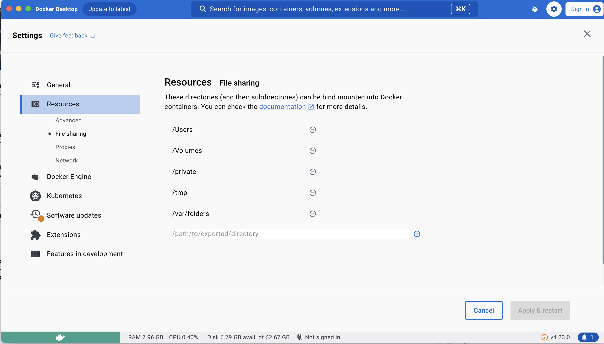

```{r setup, include=FALSE}
knitr::opts_chunk$set(echo = FALSE, message = FALSE, warning = FALSE)
```

```{r}
library(tidyverse)
library(knitr)
library(kableExtra)
library(dplyr)
```

<!-- # geocoder <a href='https://degauss.org'></a> -->

<!-- [](https://github.com/degauss-org/geocoder/releases) -->
<!-- [](https://github.com/degauss-org/geocoder/actions/workflows/build-deploy-release.yaml) -->


<!-- ## Preparation -->

## Introduction
The CTSA/CEGIR geocoding docker container provides means of geocoding a given list of CTSA/CEGIR participant addresses and determining the driving distance (in minutes) to CTSA/CEGIR centers,  identifying the center with the shortest driving distance. Users can generate an output CSV via the command line or interact with a Shiny App for a more user-friendly experience.

After installation, the software runs on a local computer without requiring an internet connection, thus maintaining the security and privacy of the participant information. The underlying software is based on [Cole Brokamp's](https://colebrokamp.com/) [deGAUSS package](https://degauss.org).

## Requirements
* Operating System:
    + MacOS
    + Windows
* RAM: 8GB
* Disk Space: 20GB (docker container is 10GB)
* administrator privileges (initially only, to install the 'docker' software)

## Step 0: Install Docker

See the [Installing Docker](https://degauss.org/using_degauss.html#Installing_Docker) webpage.

**_Note about Docker Settings:_**  
After installing Docker, but before running containers, go to **Docker Settings > Advanced** and change **memory** to greater than 4000 MB (or 4 GiB) <br> 

\begin{center}
\includegraphics[width=0.75\textwidth]{../figs/docker_settings_memory.png}
\end{center}

<!-- <center>  </center> -->
<br> If you are using a Windows computer, also set **CPUs** to 1. <br>
<!-- <center>  </center> Click **Apply** and wait for Docker to restart. -->

## Step 1: Preparing Your Input

User can perform geocoding in batch by putting the addresses together in a csv file (works with both Shiny App and command line) or seperately geocode a single valid US address in the Shiny App.

The address file must be a CSV file with either a column titled `address` containing all address components or columns titled `lat` and `lon` with the participant's latitude and longitude, respectively. Other columns may be present - in particular a `participant ID` column and an `address_date` column are recommended. If any participants have multiple addresses, `address_date` column with different date is required in order for the program to run properly. 

The software will ignore (but preserve) all additional columns besides `address`, `lat` and `lon`.

An example address CSV file might look like the following `address-sample-date-UTAH.csv` file from the docker container:

\begin{center}
\includegraphics[width=0.75\textwidth]{../figs/example_data.png}
\end{center}


Example address CSV files are [my_address_file.csv](tests/my_address_file.csv), [address-sample.csv](tests/address-sample.csv) or [address-sample-date-UTAH.csv](tests/address-sample-date-UTAH.csv), all located in the tests folder of the docker container source.

**_Note_**: Please make sure to enclose the information in the `address` column in quotation marks (e.g., "") if it contains commas.


## Step 2: Running the CTSA/CEGIR container

There are 2 options to generate output via Docker command, described below:

### 2.1 Run Shiny App via docker command

This command launches a Shiny app at http://localhost:3838:

  - macOS:
  
    ```sh
    docker run --rm -p 3838:3838 -v $PWD:/tmp ghcr.io/dohn5r/geocoder_shiny:0.0.1 --shiny
    ```
  
  - Windows (CMD):
  
    ```sh
    docker run --rm -p 3838:3838 -v "%cd%":/tmp ghcr.io/dohn5r/geocoder_shiny:0.0.1 --shiny
    ```
    
Here's a preview of the Shiny app when accessed at http://localhost:3838:

\begin{center}
\includegraphics[width=0.75\textwidth]{../figs/Shiny_App_example.png}
\end{center}

Before inputting address data, if users wish to modify default ***score*** values of 0.5 or ***output prefix*** value of "output", users need to specify those parameters:

\begin{center}
\includegraphics[width=0.75\textwidth]{../figs/Shiny_App_parameters.png}
\end{center}


For input data, users can choose any of the following options:

  -   Upload an Address file prepared in the step 1 by clicking **Browse...** option under **Upload the file** 
  -   Enter a valid US address in **Address Input** field then hit **Submit adddress or latitude & longtitude** button
  -   Enter valid US latitude and longtitude in **Enter Latitude** and **Enter Longtitude** fields, then hit **Submit adddress or latitude & longtitude** button

\begin{center}
\includegraphics[width=0.75\textwidth]{../figs/Shiny_App_input.png}
\end{center}

Once the Shiny App successfully geocoded your input, selected participant's data are displayed on top of the Shiny App, the map is in the center, and a table containing data that are not successfully geocoded is at the bottom of the app 

\begin{center}
\includegraphics[width=0.75\textwidth]{../figs/Shiny_App_geocoded.png}
\end{center}


Participant IDs will appear in **Select Participant ID** drop-down menu. Users can then select participant ID of interest in **Select Participant ID** drop-down menu. If the selected participant have multiple addresses, users can select the date of interest:

\begin{center}
\includegraphics[width=0.75\textwidth]{../figs/Shiny_App_participant_date.png}
\end{center}

By default, the participant's home address (indicated by a green home symbol) and the nearest center (indicated by an orange medkit symbol) are displayed on the map.

\begin{center}
\includegraphics[width=0.75\textwidth]{../figs/default_map_nearest_center.png}
\end{center}


### 2.2 Generate csv output via docker command

If `my_address_file.csv` is an address file in the current working directory with an address column named `address`, then the command to process it through the CTSA/CEGIR geocoding container is:

  - macOS:
  
    ```sh
    docker run --rm -v $PWD:/tmp ghcr.io/dohn5r/geocoder_shiny:0.0.1 \
    -s PCGC_UTAH -i my_address-file.csv -o UTAH_output 
    ```
  
  - Windows (CMD):
  
    ```sh
    docker run --rm -v "%cd%":/tmp ghcr.io/dohn5r/geocoder_shiny:0.0.1 ^
    -s PCGC_UTAH -i my_address-file.csv -o UTAH_output
    ```


will produce 3 output files:

- `UTAH_output.csv`: This file has full output data, __including PII data__. Do NOT sent this to the ACC.
- `UTAH_output-deid.csv`: This file contains de-identified fields specified by the user as well as location-derived information. By default, the list of de-identified fields contain "id","address_date","matched_state","precision","geocode_result","fraction_assisted_income", "fraction_high_school_edu","median_income","fraction_no_health_ins","fraction_poverty","fraction_vacant_housing", "dep_index","drivetime_selected_center","nearest_center_pcgc","drivetime_pcgc","version". “id” and “address_date” are copied verbatim from the input address file; it is the user's responsibility to ensure they don’t contain PHI
- `UTAH_output-log.txt`: This file is an output log of the processing.

### 2.1 Running via command line or interact with a Shiny App


**_Note_**: The example above uses `-s PCGC_UTAH` for CTSA/CEGIR center in Utah. To change the care center, replace `-s PCGC_UTAH` with one of the site abbrevations below (e.g., `-s PCGC_YALE`):

| **Abbreviation** |  **Name** |
|--------------------|-------------------|
PCGC_YALE | `Yale`
PCGC_BOSTON | `Boston Childrens`
PCGC_MTSINAI | `Mt. Sinai`
PCGC_COLUMBIA | `Columbia`
PCGC_CHOP | `CHOP`
PCGC_UTAH | `Utah`
PCGC_CHLA | `Childrens of LA`

**_Note_**: On Windows computers you may need to give Docker explicit permissions to access the folder containing the address file (and possibly restart the Docker daemon after you have done so). 
\begin{center}
\includegraphics[width=0.5\textwidth]{../figs/Windows_permission.png}
\end{center}

However, if notifications are disabled, the confirmation box will not appear and Docker will automatically decline the permission. In that case, go to **Docker Settings > Resources > FileSharing**. Add required folder and hit Apply & Restart




**_Note_**: The first time this process is run, docker will download the latest container from the ACC, which takes a few minutes of time. Later runs will not require internet connections (unless the container is to be updated with the latest version).

**_Note_**: After processing, __please__ inspect the output files and fix obvious formatting problems with the address file should they arise (see also the section below on input address data formatting). The `*-deid.csv` file is safe to be sent to the ACC via secure upload to AWS (similar to the EMR data uploads).

### Running the CTSA/CEGIR deGAUSS container (the longer version)

Command line parameters to show help, version and site list are as follows:

- `-h` or `--help`: Show available parameters. For example, users can use this command:

  ```sh
  docker run ghcr.io/dohn5r/geocoder_shiny:0.0.1 -h
  ```
or 
  ```sh
  docker run ghcr.io/dohn5r/geocoder_shiny:0.0.1 --help
  ```

- `-v` or `--version`: Show the current version of Docker container with this command:
  ```sh
  docker run ghcr.io/dohn5r/geocoder_shiny:0.0.1 -v
  ```
  or 
  ```sh
  docker run ghcr.io/dohn5r/geocoder_shiny:0.0.1 --version
  ```

- `--site-list`: Print all available sites with this command:
  ```sh
  docker run ghcr.io/dohn5r/geocoder_shiny:0.0.1 --site-list
  ```

This container __requires__ both of the following arguments:

- `-i` to specify the path to the input address CSV file
- `-s` or `--site` to specify theabbreviation of the CTSA/CEGIR center of interest

| **Abbreviation** |  **Name** |
|--------------------|-------------------|
PCGC_YALE | `Yale`
PCGC_BOSTON | `Boston Childrens`
PCGC_MTSINAI | `Mt. Sinai`
PCGC_COLUMBIA | `Columbia`
PCGC_CHOP | `CHOP`
PCGC_UTAH | `Utah`
PCGC_CHLA | `Childrens of LA`


This container takes the following optional arguments:

-   `-o` or `--output-file-prefix` to specify prefix of output files. By default, the prefix is `output`, which will generate output.log, output-phi.csv, output-deid.csv
-   `--f` or `--include-deid-fields` to specify list of fields to include in output. Default fields:
    - id, address_date, precision, geocode_result, fraction_assisted_income, fraction_high_school_edu, median_income, fraction_no_health_ins, fraction_poverty, fraction_vacant_housing, dep_index, drivetime_selected_center, nearest_center_pcgc, drivetime_pcgc, version
-   `--force` to force the container to overwrite output files if one of the output files already exists. By default, the program would exit if one of the output files already exists

### Running the CTSA/CEGIR  container (additional details)
This Docker image does the following:

1. perform geocoding on addresses (if not geocoded already, i.e., if `lat` and `lon` are not specified in the input), adding the following columns:

  - **`matched_street`**, **`matched_city`**, **`matched_state`**, **`matched_zip`**: matched address componets (e.g., `matched_street` is the street the geocoder matched with the input address); can be used to investigate input address misspellings, typos, etc.
  - **`precision`**: The method/precision of the geocode. The value will be one of:
    - `range`: interpolated based on address ranges from street segments
    - `street`:  center of the matched street
    - `intersection`: intersection of two streets
    - `zip`: centroid of the matched zip code
    - `city`: centroid of the matched city
  - **`score`**: The percentage of text match between the given address and the geocoded result, expressed as a number between 0 and 1. A higher score indicates a closer match. Note that each score is relative within a precision method (i.e. a `score` of `0.8` with a `precision` of `range `is not the same as a `score` of `0.8` with a `precision` of `street`). 
  - **`lat`** and **`lon`**: geocoded coordinates for matched address
  - **`geocode_result`**: A character string summarizing the geocoding result. The value will be one of
    + `geocoded`: the address was geocoded with a `precision` of either `range` or `street` and a `score` of `0.5` or greater.
    + `imprecise_geocode`: the address was geocoded, but results were suppressed because the `precision` was `intersection`, `zip`, or `city` and/or the `score` was less than `0.5`.
    + `po_box`: the address was not geocoded because it is a PO Box
    + `non_address_text`: the address was not geocoded because it was blank or listed as "foreign", "verify", or "unknown" 
    

- then compute drive time to a Pediatric Cardiac Genomics Consortium (CTSA/CEGIR) specified by user, adding the following columns:
  - **`drivetime_selected_center`**: computed estimated drive time to center specified by user
  - **`nearest_center_pcgc`**: Nearest CTSA/CEGIR center as computed by the Docker image 
  - **`distance_pcgc`**: Distance to the nearest CTSA/CEGIR center as computed by the Docker image 

# Details on the processing steps contained in the software

#### 1. Geocoding
##### Input address data formatting

- Other columns may be present, but it is recommended to only include `address`, an optional identifier column (e.g., `id`) and an optional `address_date` column.
- Address data must be in one column called `address`. 
- Separate the different address components with a space
- Do not include apartment numbers or "second address line" (but its okay if you can't remove them)
- ZIP codes must be five digits (i.e. `32709`) and not "plus four" (i.e. `32709-0000`)
- Do not try to geocode addresses without a valid 5 digit zip code; this is used by the geocoder to complete its initial searches and, if missing, will likely return incorrect matches
- Spelling should be as accurate as possible, but the program does complete "fuzzy matching" so an exact match is not striclty necessary
- Capitalization does not affect results
- Abbreviations may be used (i.e. `St.` instead of `Street` or `OH` instead of `Ohio`)
- Use Arabic numerals instead of written numbers (i.e. `13` instead of `thirteen`)
- Address strings with out of order items could return NA (i.e. `3333 Burnet Ave Cincinnati 45229 OH`)
- Geomarker data used was prepared following the instructions [here](https://degauss.org/manual_install.html) using the 2021 TIGER/Line Street Range Address files from the Census

#### 2. Drive time

This container uses isochrones to assign drive time to care center for each input address. Drive time isochrones are concentric polygons, in which each point inside a polygon has (roughly) the same drive time to the care center. Below is an example of drive time isochrones around the CTSA/CEGIR center in Utah


Drive time isochrones were obtained using a [self-hosted openroute service](https://maps.openrouteservice.org/reach?n1=38.393339&n2=-95.339355&n3=5&b=0&i=0&j1=30&j2=15&k1=en-US&k2=km) in order to overcome the time limitations of the publicly available API.

<!-- Drive time is computed based on distance between input address and care center: -->
<!-- <center>drive_time = distance/60</center> -->

We defined 24 levels of isochrones with driving distances up to 960 minutes (16 hours):  15  30  45  60  75  90  105 120 135 150 165 180 195 210 225 240 300 360 420 480 600 720 840 960 minutes


<!-- ##### Geomarker Data -->

<!-- - `download_isochrones.R` was used to download and prepare drive time isochrones -->
<!-- - Isochrone shape files are stored at [`s3://geomarker/drivetime/isochrones/`](https://geomarker.s3-us-east-2.amazonaws.com/drivetime/isochrones) -->
<!-- - A list of available care center addresses is also stored at [`s3://geomarker/drivetime/center_addresses.csv`](https://geomarker.s3-us-east-2.amazonaws.com/drivetime/center_addresses.csv) -->


## DeGAUSS Details

 For detailed documentation on DeGAUSS, including general usage and installation, please see the [DeGAUSS homepage](https://degauss.org).